# Security Automation Lab (Splunk SOAR + AD + MITRE ATT&CK)
This project simulates a real-world Security Operations workflow using Splunk SOAR, Splunk Enterprise, and Active Directory to automate incident response for suspicious logins-based on MITRE ATT&CK techniques.
> Automates account disablement afteranalyst triage via email approval

## Key Features
- Detection of successful RDP logins from suspicious IPs (Event ID 4624)
- Automated email sent to analyst for triage
- Waits for analyst input, then disables the user account in AD if needed
- Detection aligned with MIRE ATT&CK techniques
- Built entirely in a segmented network
- Fully on-premise Splunk Enterprise and Splunk SOAR

## Technologies Used
- **Splunk Enterprise**
- **Splunk SOAR (Phantom)**
- **Windows Server** w/ **Active Directory Domain Services**
- **pfSense** Firewall, NAT, and routing
- Windows Event Logging
- **Kali Linux** w/ rdesktop for generating RDP event code

## Lab Architecture
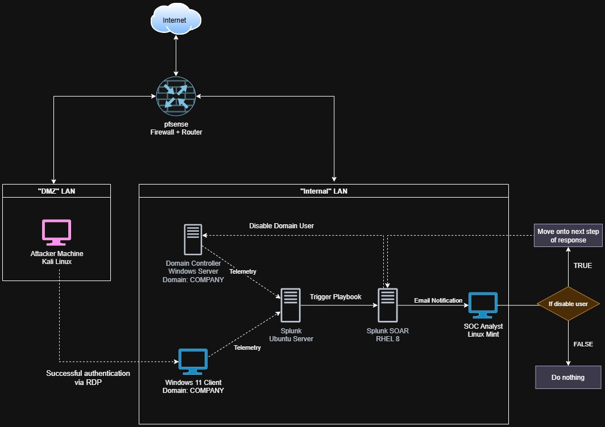
### How it works
1. A simulated RDP login from a Kali Linux machine using rdesktop triggers a Windows Event ID 4624 w/ Event code 10
2. Windows Server and Windows 11 Client sends telemetry to Splunk server via UFW
3. A Splunk alert (scheduled via cron) detects the logon and triggers a SOAR playbook
4. The playbook sends an email to a security analyst asking whether to disable the AD account
5. The analyst reviews the alert in Splunk SOAR and responds with YES or NO.
6. Splunk SOAR playbook checks for the analyst's decision:
   - If YES, the SOAR playbook disables the user account in Active Directory using an LDAP action
   - If NO, the playbook ends the response with no action

## Documentation
For full documentation of all steps taken and troubleshooting, see [FullDocumentationADSOAR.pdf](FullDocumentationADSOAR.pdf)

## Screenshots
### Initial setup and configuration
ADDS Setup:
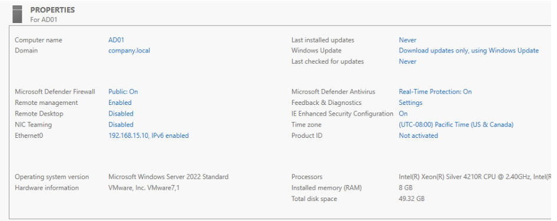

Creation of user account in domain COMPANY:

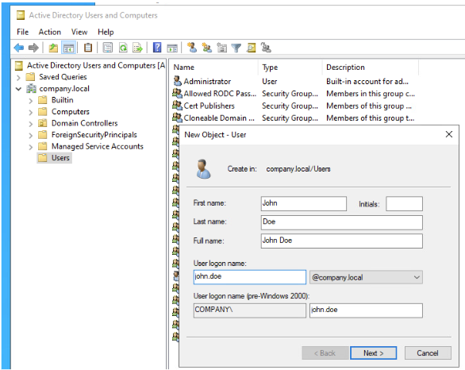

Splunk SOAR initial bootup in RHEL 8:

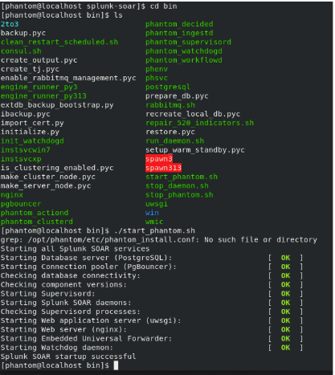

pfSense network interface configurations:

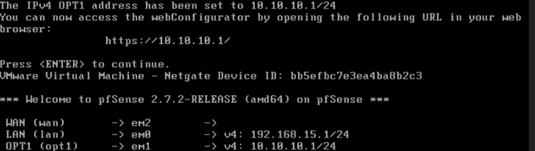

Setting up UFW to send Windows Security Logs from Windows Server and Windows 11 Client to Splunk:

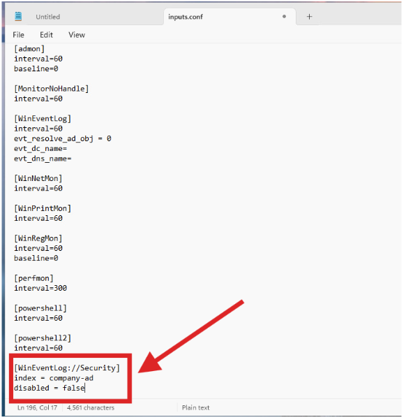

Splunk logs showing both devices sending telemetry:

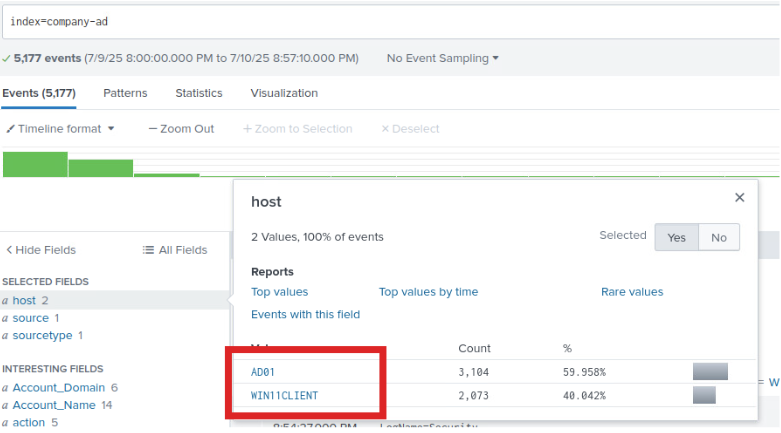

Splunk SOAR dashboard:

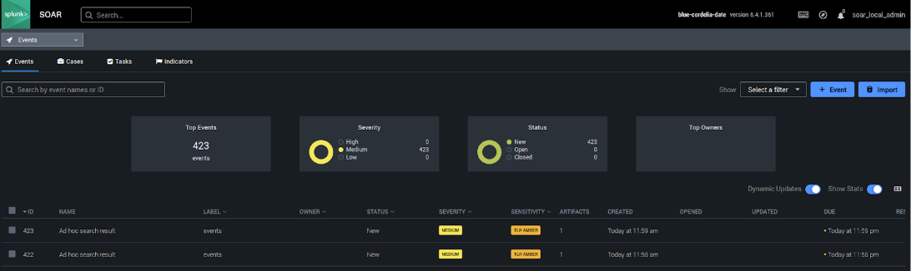

### RDP Attack + Splunk Alert
Weak firewall configuration that allows for all port attacks (in this example RDP):

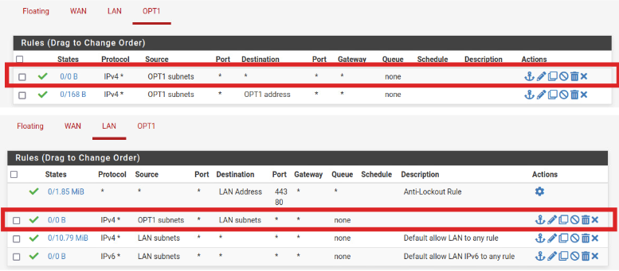

Kali Linux Device using rdesktop to RDP into Windows 11 Client w/ John Doe's credentials:

Event that was generated in Splunk:

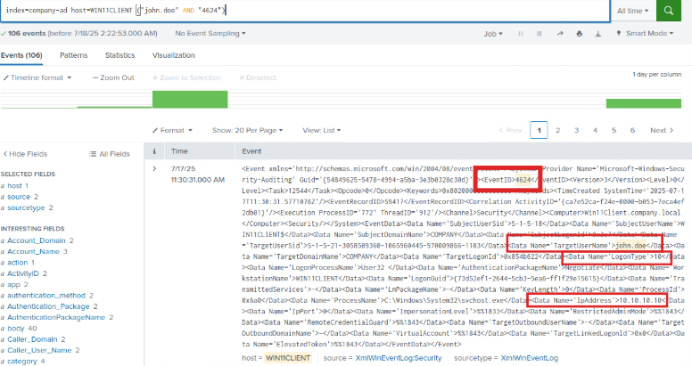

### Triage and Playbook
Splunk SOAR Playbook:

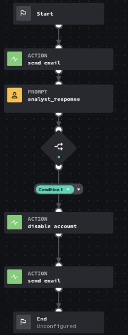

Email sent to analyst when alert is triggered:

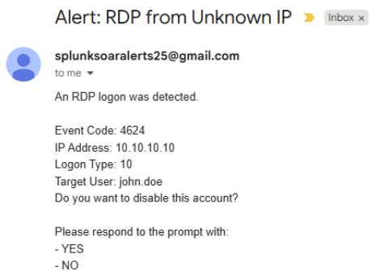

Analyst response on Splunk SOAR (Yes/No):

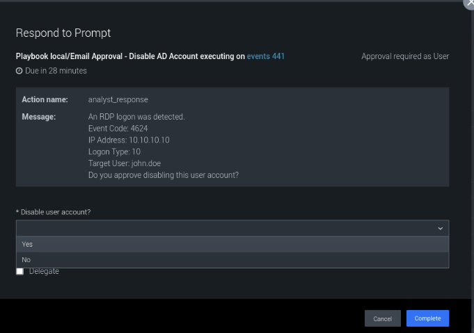

When analyst clicks Yes, it disabled account John Doe in Active Directory:

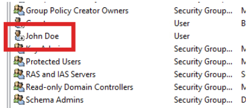

Follow up email regarding the status of account that was disabled:

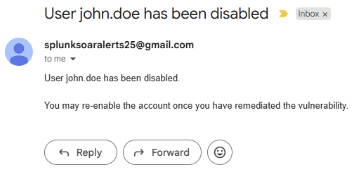

## Skills Demonstrated
- Security automation using Splunk SOAR
- Event correlation & field extraction using Splunk Enterprise
- Playbook development in SOAR
- AD integration and automation
- Windows log analysis
- Homelab networking & segmentation

