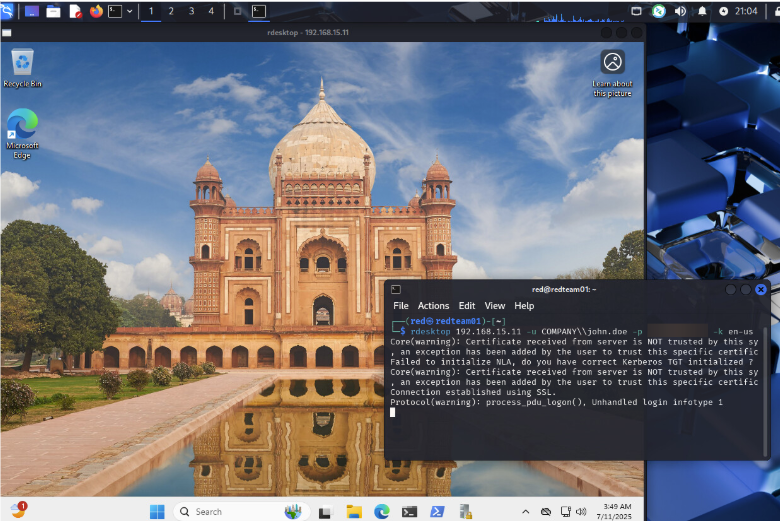

# Security Automation Lab (Splunk SOAR + AD + MITRE ATT&CK)
This project simulates a real-world Security Operations workflow using Splunk SOAR, Splunk Enterprise, and Active Directory to automate incident response for suspicious logins-based on MITRE ATT&CK techniques.
> Automates account disablement afteranalyst triage via email approval

## Key Features
- Detection of successful RDP logins from suspicious IPs (Event ID 4624)
- Automated email sent to analyst for triage
- Waits for analyst input, then disables the user account in AD if needed
- Detection aligned with MIRE ATT&CK techniques
- Built entirely in a segmented homelab network

## Technologies Used
- Splunk Enterprise
- Splunk SOAR (Phantom)
- Windows Server w/ Active Directory Domain Services
- pfSense Firewall, NAT, and routing
- Windows Event Logging
- Kali Linux w/ rdesktop for generating RDP event code

## Lab Architecture

### How it works
1. A simulated RDP login from a Kali Linux machine using rdesktop triggers a Windows Event ID 4624 w/ Event code 10
2. Windows Server and Windows 11 Client sends telemetry to Splunk server via UFW
3. A Splunk alert (scheduled via cron) detects the logon and triggers a SOAR playbook
4. The playbook sends an email to a security analyst asking whether to disable the AD account
5. The analyst reviews the alert in Splunk SOAR and responds with YES or NO.
6. Splunk SOAR playbook checks for the analyst's decision:
   - If YES, the SOAR playbook disables the user account in Active Directory using an LDAP action
   - If NO, the playbook ends the response with no action

## Screenshots
### Initial setup and configuration

### Attack + Alert

### Triage

